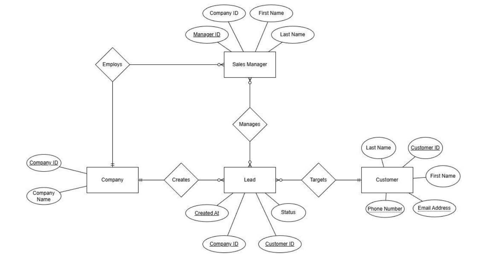
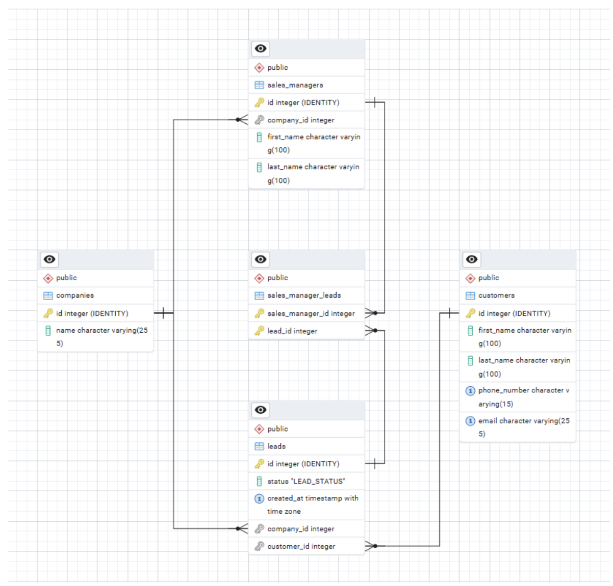

# Розрахунково Графічна Робота з дисципліни "Бази Даних і Засоби Управління"

## Роботу Виконав
Студент: Козлов Сергій Олександрович
Група: КВ-33
Telegram: @Teollan

## Предметна галузь
Система управління клієнтами для компаній

---

## Зміст

- [Вимоги](#вимоги)
- [Встановлення](#встановлення)
- [Налаштування](#налаштування)
- [Налаштування бази даних](#налаштування-бази-даних)
- [Запуск застосунку](#запуск-застосунку)
- [Огляд модулів](#огляд-модулів)
- [Схема бази даних](#схема-бази-даних)
- [Можливості](#можливості)
- [Технологічний стек](#технологічний-стек)

---

## Вимоги

Для інсталювання, конфігурації і запуску програми необхідні:

- **Node.js** (v18.0.0 або вище) - [Завантажити](https://nodejs.org/)
- **PostgreSQL** (v14.0 або вище) - [Завантажити](https://www.postgresql.org/download/)
- **psql** (клієнт командного рядка PostgreSQL) - входить до складу встановлення PostgreSQL

---

## Встановлення

1. **Клонуйте репозиторій:**
   ```bash
   git clone <repository-url>
   cd 2025-bdzu-rgr-ts
   ```

2. **Встановіть залежності:**
   ```bash
   npm install
   ```

---

## Налаштування

1. **Скопіюйте файл-приклад середовища:**
   ```bash
   cp .env.example .env
   ```

2. **Відредагуйте `.env` вашими обліковими даними бази даних:**
   ```env
   # DB config
   DB_HOST=localhost
   DB_PORT=5432
   DB_NAME=postgres
   DB_USERNAME=postgres
   DB_PASSWORD=your_password_here

   # App config
   DEBUG_MODE=false    # Set to true to enable SQL query logging
   PAGE_SIZE=20        # Number of items per page for pagination
   ```

---

## Налаштування бази даних

1. **Створіть таблиці бази даних:**
   ```bash
   make create-tables
   ```

2. **Заповніть базу даних тестовими даними і даними для генерації рандомізованих сутностей:**
   ```bash
   make seed-tables
   ```

3. *(За необхідності)* **Видаліть усі таблиці:**
   ```bash
   make drop-tables
   ```

---

## Запуск застосунку

**Запустіть застосунок:**
```bash
npm start
```

**Режим розробки (з автоматичним перезавантаженням):**
```bash
npm run dev
```

---

## Огляд модулів

### Модуль компаній
Управління записами компаній у системі.

**Можливості:**
- CRUD операції
- Перегляд усіх компаній (з пагінацією)
- Пошук компанії за ID
- Пошук компаній з великою клієнтською базою (складний запит з GROUP BY, HAVING)
- Генерація випадкових компаній

---

### Модуль клієнтів
Управління записами клієнтів з контактною інформацією.

**Можливості:**
- CRUD операції
- Перегляд усіх клієнтів (з пагінацією)
- Пошук клієнта за ID / Email / Номером телефону
- Пошук клієнтів, з якими зв'язувався менеджер (складний запит з JOIN, ILIKE, діапазон дат)
- Валідація email та номера телефону
- Забезпечення унікальних обмежень
- Генерація випадкових клієнтів

---

### Модуль лідів
Управління лідами продажів, що пов'язують компанії та клієнтів.

**Можливості:**
- CRUD операції
- Перегляд усіх лідів (з пагінацією)
- Пошук ліда за ID
- Призначення вільних лідів менеджерам (складний запит з CTE)
- Управління статусами лідів (PENDING, IN_PROGRESS, WON, LOST)
- Валідація зовнішніх ключів для компанії та клієнта
- Генерація випадкових лідів

---

### Модуль менеджерів з продажу
Управління записами менеджерів з продажу та аналітика ефективності.

**Можливості:**
- CRUD операції
- Перегляд усіх менеджерів з продажу (з пагінацією)
- Пошук менеджера за ID
- Пошук найкращих виконавців за компаніями (складний запит з розрахунком конверсії)
  - Фільтр за діапазоном ID компаній
  - Фільтр за діапазоном дат
  - Фільтр за цільовим коефіцієнтом конверсії
- Генерація випадкових менеджерів

---

## Схема бази даних

### ER-модель предметної галузі



### Основні Таблиці


### Допоміжні таблиці (для генерації випадкових даних)

| Таблиця | Призначення |
|---------|-------------|
| `first_names` | Набір імен |
| `last_names` | Набір прізвищ |
| `email_domains` | Набір доменів електронної пошти |
| `adjectives` | Набір прикметників для назв компаній |
| `nouns` | Набір іменників для назв компаній |
| `designators` | Набір позначень компаній (Inc., LLC, тощо) |

---

## Можливості

### CRUD операції
- Перегляд, створення, оновлення та видалення записів для всіх сутностей
- Пагіновані списки з навігацією вперед/назад
- Підтвердження видалення з попередженнями про каскадне видалення

### Валідація даних
- **Валідація типів**: рядки, числа, дати перевіряються при введенні
- **Валідація формату**: формати email та номера телефону
- **Обов'язкові поля**: забезпечення заповнення обов'язкових полів
- **Валідація зовнішніх ключів**: перевірка існування батьківського запису перед вставкою/оновленням
- **Унікальні обмеження**: запобігає дублюванню email та номерів телефонів

### Генерація випадкових даних
- Генерація великих обсягів тестових даних (до 250 000 записів)
- Усі дані генеруються через SQL з використанням функцій PostgreSQL
- Дотримання обмежень зовнішніх ключів
- Генерація реалістичних email, номерів телефонів та назв компаній

### Складні пошукові запити
1. **Компанії з великою клієнтською базою** - агрегація з GROUP BY та HAVING
2. **Клієнти, з якими зв'язувався менеджер** - багатотабличний JOIN з ILIKE та діапазоном дат
3. **Найкращі менеджери з продажу** - аналітика з розрахунком коефіцієнта конверсії

### Відлагодження запитів
- Час виконання (для складних запитів)
- Режим відлагодження SQL запитів

---

## Технологічний стек

Мова програмування: TypeScript
БД: PostgreSQL
Бібліотека для взаємодії з БД: [postgres](https://github.com/porsager/postgres)
